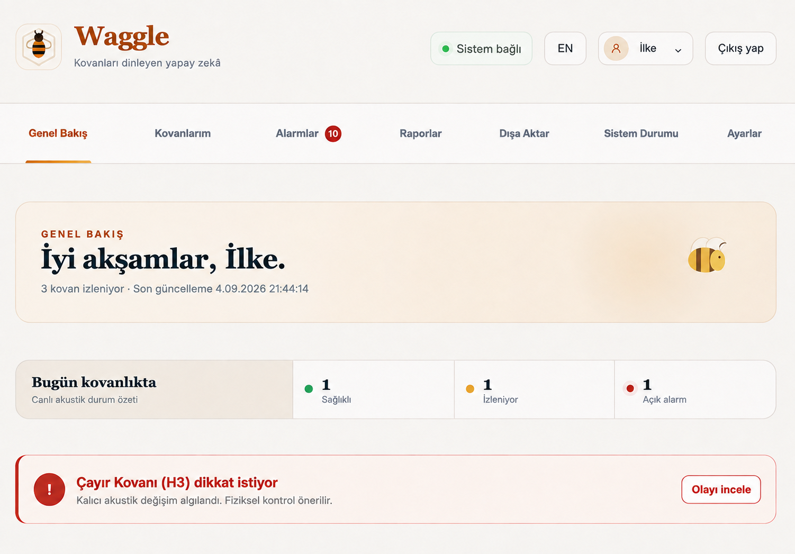
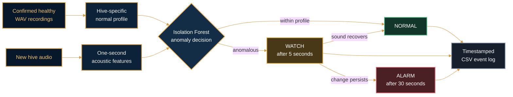

<div align="center">
  
</div>

<h1 align="center">Waggle — Every Hive Has Its Own Baseline</h1>

<p align="center">
  A colony-specific acoustic monitoring system that learns each hive's normal
  sound and provides early warning of persistent changes compatible with queen loss.
</p>

<p align="center">
  <a href="#current-evidence">Evidence</a> ·
  <a href="#application-overview">Application</a> ·
  <a href="#processing-flow">How it works</a> ·
  <a href="#quick-start">Quick start</a> ·
  <a href="#2-reproduce-the-mendeley-replay">Reproduce</a> ·
  <a href="#authors-and-license">License</a>
</p>

<table>
  <tr>
    <th width="33%">LEARN</th>
    <th width="33%">LISTEN</th>
    <th width="33%">WARN</th>
  </tr>
  <tr>
    <td align="center">Builds a normal profile from confirmed healthy recordings</td>
    <td align="center">Compares each new second with that hive's own acoustic baseline</td>
    <td align="center">Escalates only when the acoustic change persists</td>
  </tr>
</table>

## Current evidence

<table>
  <tr>
    <th width="25%">Balanced accuracy proxy</th>
    <th width="25%">Queen-loss sensitivity</th>
    <th width="25%">Healthy specificity</th>
    <th width="25%">Persistent alarm</th>
  </tr>
  <tr>
    <td align="center"><strong>94.17%</strong></td>
    <td align="center"><strong>100%</strong></td>
    <td align="center"><strong>88.33%</strong></td>
    <td align="center"><strong>30 seconds</strong></td>
  </tr>
</table>

The strongest result uses the public [Mendeley sudden queen-loss
dataset](https://data.mendeley.com/datasets/j97khfj656/1) (DOI
`10.17632/j97khfj656.1`): six complete days from one colony, with queen removal
on the morning of the final day.

| Evaluation stage | Data used | Outcome |
| --- | --- | --- |
| Healthy-profile training | Queenright days 1–4 | Baseline learned |
| Untouched validation | Queenright day 5 | No persistent alarm |
| Untouched test | Queenless day 6 | `WATCH` at 5 s, `ALARM` at 30 s |

> **What the alarm means**<br/>
> Persistent acoustic change compatible with queen loss was detected. Check
> the hive and queen.

The 94.17% figure is the arithmetic mean of held-out queen-loss sensitivity
(100%) and held-out healthy specificity (88.33%). It is reported as a balanced
accuracy proxy because the two classes come from separate complete days.

An alarm is not proof that the queen has died. Disease, swarming, environmental
noise, microphone movement and other colony stresses can also alter hive
acoustics. The 94.17% result demonstrates a colony-specific change detector on
one published feature dataset, not universal performance on arbitrary raw WAV
recordings or unseen hives. Dataset provenance, splits, metrics, artefacts, and
reproduction boundaries are documented in [`docs/DATASETS.md`](docs/DATASETS.md).

## Application overview

Waggle pairs the acoustic monitor with an authenticated, offline-first local
panel. The interface keeps model enrollment, live hive state, alarm inspection,
weekly reports, exports and system health in one place without presenting an
acoustic anomaly as a confirmed diagnosis.

<div align="center">
  
  <sub>Demo data: one healthy hive, one hive under watch and one persistent alarm requiring physical inspection.</sub>
</div>

<br/>

<p align="center">
  <strong>Observe</strong> live hive state ·
  <strong>Investigate</strong> persistent alarms ·
  <strong>Document</strong> inspections and reports
</p>

## Processing flow



Raw WAV processing uses mono 16-bit PCM audio, resamples to 16 kHz when
necessary and extracts 21 pyAudioAnalysis features with 50 ms windows, 25 ms
steps and one-second aggregation.

## Quick start

Python 3.9 or newer is recommended.

### 1. Create the environment

```bash
python3 -m venv .venv
source .venv/bin/activate
python -m pip install -r requirements.txt
```

### 2. Reproduce the Mendeley replay

Download the Mendeley CSV and place it at:

```text
data/queen_loss_africanized_honeybee_dataset.csv
```

Run:

```bash
python ear/mendeley_streaming_monitor.py
```

Expected replay:

```text
{'date': '2019-08-30', ..., 'watch_completion_window': 361,
 'alarm_completion_window': None}
{'date': '2019-09-02', ..., 'watch_completion_window': 5,
 'alarm_completion_window': 30}
model=.../results/mendeley_isolation_monitor.joblib
result=.../results/mendeley_streaming_replay.json
```

The healthy validation day briefly reaches `WATCH` but never reaches the
30-consecutive-window `ALARM` threshold. The queenless test recording reaches
`WATCH` at second 5 and `ALARM` at second 30. These times are measured from the
start of that recording, not from the moment of queen removal.

The command writes:

```text
results/mendeley_isolation_monitor.joblib
results/mendeley_streaming_replay.json
```

### 3. Build a development WAV profile

First ingest a confirmed healthy WAV:

```bash
python ear/add_field_recording.py healthy.wav \
  --field-dir data/field \
  --timestamp 2026-09-14T12:00:00+03:00 \
  --site SITE01 --hive HIVE03 --device DEV01 \
  --microphone "microphone-model" --position "fixed-position" \
  --temperature 25 --humidity 60 --inspection queen_present
```

For a software demonstration with insufficient enrollment data:

```bash
python ear/build_wav_isolation_profile.py data/field/manifest.csv \
  --hive HIVE03 --output results/HIVE03_isolation.joblib \
  --development-override
```

`--development-override` profiles are for software testing only. Production
profile creation requires at least 42 confirmed healthy sessions across 14
days, one fixed hardware configuration and complete temperature/humidity
metadata.

### 4. Monitor a WAV folder

```bash
mkdir -p inbox events
python ear/monitor_wav_folder.py \
  results/HIVE03_isolation.joblib inbox \
  --state events/HIVE03_state.json \
  --log events/HIVE03_events.csv \
  --watch --poll-seconds 5
```

Stop continuous monitoring with `Control-C`. Processed filenames and SHA-256
hashes are retained so unchanged files are not analyzed twice.

### Phone enrollment and monitoring

<details>
<summary><strong>Enrollment lifecycle and ONNX verification</strong></summary>
<br/>

The authenticated panel places phone capture inside each hive rather than exposing
it as a generic classifier: **My hives → Devices and model → Add device**. A new
hive starts in `device_required`, moves to `enrolling` and accepts audio only as
confirmed healthy baseline data. Waggle stores the extracted 21-feature windows
in SQLite and deletes the uploaded raw WAV after processing.

Waggle requests a short field-health check at enrollment start and no more than
once every four days. Direct queen observation, a healthy egg/brood pattern, or
a generally healthy inspection can validate the current collection period;
`unsure` is recorded but never admitted to training. At 42 healthy sessions
across 14 distinct days and at least four accepted field confirmations, Waggle automatically trains a
hive-and-microphone-specific `RobustScaler + IsolationForest`, exports it to ONNX,
and compares every training-window decision between the Python and ONNX models.
Monitoring is activated only when decision parity is exact. The export also carries
the estimator's decision offset in the graph metadata, which is what lets inference
read the graph's score output as a severity: how far a window fell outside the
profile, beside how many windows did. Every per-hive profile must pass exact decision
parity on its training windows. The packaged reference export additionally checks
score drift against a documented floating-point tolerance across all 5,400 source
rows. From then on, phone recordings enter the normal `NORMAL` / `WATCH` / `ALARM`
flow. The packaged H3 profile remains the pre-enrolled presentation path when
prospective field data is not available.

</details>

## Repository map

| Path | Purpose |
| --- | --- |
| `ear/mendeley_streaming_monitor.py` | Reproduce the sudden queen-loss replay |
| `ear/export_onnx_model.py` | Export and verify the portable ONNX monitor |
| `ear/profile_training.py` | Train and parity-check a hive-specific ONNX profile |
| `ear/wav_isolation_monitor.py` | Score a single WAV recording |
| `ear/build_wav_isolation_profile.py` | Build a hive-specific healthy profile |
| `ear/monitor_wav_folder.py` | Continuously process incoming WAV files |
| `ear/add_field_recording.py` | Ingest a recording with field metadata |
| `ear/validate_field_manifest.py` | Check metadata and profile readiness |
| `panel/` | Authenticated local monitoring and inspection interface |
| `brain/` | Reviewed retrieval and bilingual local report generation |
| `tools/` | Demo, event delivery, recovery and presentation utilities |
| `data/` | Local datasets; excluded from Git |
| `results/` | Selected model artifact and evaluation metrics |
| [`docs/FIELD_PROTOCOL.md`](docs/FIELD_PROTOCOL.md) | Field recording and enrollment protocol |

## Research pipeline ready

The acoustic monitoring pipeline is complete and reproducible from profile
creation to persistent alarm generation.

| Capability | Result |
| --- | --- |
| Sudden queen-loss replay | Reproduces the held-out validation and test results |
| Raw-WAV processing | Resampling and one-second acoustic feature extraction operational |
| Hive enrollment | Builds a personal healthy baseline from labeled recordings |
| Persistent monitoring | Produces `NORMAL`, `WATCH` and `ALARM` states |
| Continuous operation | Monitors incoming WAV files without duplicate processing |
| Event output | Writes timestamped, integration-ready CSV records |
| Portable inference | ONNX Runtime decisions match joblib on all 5,400 verification windows |

### Portable ONNX inference

<details>
<summary><strong>Model export, parity and system-health details</strong></summary>
<br/>

The selected `RobustScaler + IsolationForest` pipeline is packaged as
`results/mendeley_isolation_monitor.onnx`. The graph retains the 21-feature
schema and the 5-second `WATCH` / 30-second `ALARM` rules as model metadata.
Reproduce the export and full CSV decision-parity check with:

```bash
python ear/export_onnx_model.py \
  results/mendeley_isolation_monitor.joblib \
  results/mendeley_isolation_monitor.onnx \
  --verification-csv data/queen_loss_africanized_honeybee_dataset.csv \
  --report results/mendeley_onnx_parity.json
```

The WAV tools accept either format without changing their command-line usage:

```bash
python ear/wav_isolation_monitor.py \
  results/mendeley_isolation_monitor.onnx recording.wav
```

This repository provides the tested acoustic detection layer that can feed an
application interface, local report generator or notification service. Its
validated claim remains precise: Waggle detects persistent change relative to
a hive's learned healthy acoustic profile; an alarm requests inspection rather
than declaring queen death as a certainty.

The authenticated **Sistem Durumu** page shows database integrity, stored record counts,
and the latest device/model and report integration activity in user-friendly language.
It also carries an **Akustik model (ONNX)** component that checks the packaged model and
every monitored hive's own profile are still on disk and reports the recorded decision
comparison behind them: the reference model's parity report and, per hive, the check made
at training time and stored with the profile.

Panel name, location, alert sound and refresh interval can be changed from the
authenticated **Ayarlar** page and are stored persistently in SQLite. The acoustic
monitor, not the panel, determines `NORMAL`, `WATCH` and `ALARM` states.

The system status screen marks device/model activity as delayed when no new event
arrives for 15 minutes and weekly reports as stale after eight days. These
thresholds can be changed with `WAGGLE_DEVICE_STALE_SECONDS` and
`WAGGLE_REPORT_STALE_SECONDS`.

First-time users receive a four-step quick-start guide. Completion is stored in SQLite,
and the guide can be reopened later from the settings page.

</details>

## Run the panel locally

```bash
python3 -m venv .venv
source .venv/bin/activate
pip install -r requirements.txt
cp .env.example .env
# Edit .env and replace the example secrets.
uvicorn panel.app.main:app --reload
```

Python 3.10+ is recommended. Python 3.9 is supported through the conditional
`eval_type_backport` dependency in `requirements.txt`.

For a presentation-ready server with deterministic H1/H2/H3 events and a
weekly report, use the one-command demo:

```bash
python tools/run_demo.py
```

See [`DEMO_CHECKLIST.md`](DEMO_CHECKLIST.md) for the presentation flow and
recovery steps. [`PRESENTATION_GUIDE.md`](PRESENTATION_GUIDE.md) contains a
four-minute Turkish narration, closing message and answers to likely questions.

Open <http://127.0.0.1:8000> and sign in with the local demo account:

- Username: `admin`
- Password: `waggle-demo`

To open the panel from an unused Android phone on the same trusted local network,
run `python tools/run_demo.py --lan` and use the phone address printed in the
terminal. This does not require internet access. See
[`FIELD_PHONE.md`](FIELD_PHONE.md) for setup, troubleshooting and security notes.

Configuration is loaded automatically from `.env`, which is ignored by Git.
Set `WAGGLE_ENV=production` for a real deployment; startup then fails if the
default password, device key, session secret or secure cookie setting is unsafe.
Sessions expire after eight hours by default.

The panel supports dynamic hive and device management, tracked healthy-baseline
enrollment, automatic per-hive ONNX profile creation, alarm acknowledgement, CSV/JSON
exports, SQLite backup and restore, system-health monitoring and authenticated
local access. The `TR / EN` control switches the interface, date formatting,
and preferred report language. Development credentials are for local demonstration only.

## Generate bilingual reports with Foundry Local

Waggle uses the locally cached `phi-3.5-mini` model to select a constrained
operational priority and approved action codes. The application validates that
structure and renders the final report from reviewed Turkish or English safety
text, so the model cannot turn an acoustic alarm into a definitive diagnosis.

<details>
<summary><strong>Local inference, retrieval and weekly-agent details</strong></summary>
<br/>

Where the local endpoint supports it, the object is requested through the server's
JSON mode rather than only asked for in the prompt and streamed rather than waited
for. Streaming distinguishes a stalled model from a slow one. Silence between
tokens ends a run in well under a minute while a model still writing is left to
finish. It also lets the panel report how much the model has written instead of
showing a bare counter. An endpoint that recognises neither parameter is asked again
without both and remembered. The device Foundry runs the model on (GPU, NPU or CPU)
is read from the same catalogue as its tool support and travels with the run's
status. Setting `WAGGLE_LLM_UNLOAD_AFTER_REPORT=1` releases the models when a run
finishes, trading a reload for the memory they hold.

Before inference, a deterministic offline retriever selects the most relevant
passages from `brain/knowledge/hive_guidance.json`. It matches Turkish
morphologically: suffixes attach to the stem, so `kraliçesiz` finds the note that
says `kraliçesizlik` and a final consonant softened by a suffix is followed through
(`hırsızlık` to `hırsızlığı`). An inflected match stays weighted below the
word itself, each searched word scores at most once however many forms a passage
uses and a query sharing no stem with the base still returns nothing. Retrieved
source IDs remain attached to the assessment for traceability; no recording or user
data is added to the knowledge base.

Install Foundry Local and download the model once:

```bash
brew install microsoft/foundrylocal/foundrylocal
foundry model download phi-3.5-mini
```

Generate either language and send it to a running panel:

```bash
python -m brain.foundry_report --language tr
python -m brain.foundry_report --language en
```

For the complete offline presentation flow with both reports:

```bash
python tools/run_demo.py --foundry
```

Foundry Local and Phi run on-device. If the local model is unavailable or its
structured output fails validation, Waggle uses a deterministic safety fallback
and records the report generator so the provenance remains visible in SQLite.

Generate both language versions from the latest seven days of panel events with
the Microsoft Agent Framework weekly-report agent (Python 3.10+):

```bash
source .venv/bin/activate
python -m brain.weekly_agent
```

For continuous local operation, use `python -m brain.weekly_agent --watch`.
The default interval is 168 hours and can be changed with `--interval-hours`.
The agent reads events, retrieves reviewed local guidance and invokes Phi with
Microsoft Agent Framework through Foundry Local's OpenAI-compatible local API.
It stores the Turkish and English reports through the same authenticated API.
Each successful report records an
`agent-framework:foundry-local:*` generator value in SQLite. If Agent Framework
or the local model is unavailable, the same diagnostic-safe deterministic
fallback remains available and its provenance is recorded instead.

</details>

## Send an event from an edge device

Panel users authenticate with a browser session. Edge services use a separate
`X-Device-Key` that can only submit events and generated reports.

<details>
<summary><strong>Device delivery, demo tools, privacy and operations</strong></summary>
<br/>

Set a strong key on both the server and device before deployment:

```bash
export WAGGLE_DEVICE_KEY="replace-with-a-long-random-key"
uvicorn panel.app.main:app --reload
```

Send a model result from another terminal:

```bash
export WAGGLE_DEVICE_KEY="replace-with-a-long-random-key"
python tools/send_event.py --hive H4 --status ALARM \
  --anomaly-fraction 1.0 --consecutive-anomalies 30 \
  --source-file queen_loss_sample.wav
```

The client retries temporary failures and stores unsent events in
`.waggle_pending_events.jsonl`. On the next run it sends queued events first.
For local demos, both sides default to `waggle-device-demo`.

To send real folder-monitor results directly to the panel, run:

```bash
python ear/monitor_wav_folder.py \
  results/HIVE03_isolation.joblib inbox \
  --state events/HIVE03_state.json \
  --log events/HIVE03_events.csv \
  --panel-url http://127.0.0.1:8000/api/events \
  --panel-hive H3 --watch --poll-seconds 5
```

If the panel is temporarily unavailable, these model events use the same local
retry queue and are delivered when connectivity returns.

Open <http://127.0.0.1:8000>. In a second terminal, activate the same
environment and start the simulated event stream:

```bash
python tools/fake_events.py
```

To add a demo weekly report, run:

```bash
python tools/fake_report.py
```

The core product is offline-first. Online weather is disabled by default and no
coordinates are sent to a third party unless a user explicitly enables it in
**Ayarlar**. When enabled, the apiary's own coordinates are sent to Open-Meteo
and cached for ten minutes. Those coordinates live in the panel and are edited
under **Ayarlar → Genel**; `WAGGLE_LAT` and `WAGGLE_LON` only seed them on a new
installation and `WAGGLE_LOCATION` seeds the label shown beside them. The label
and the position are separate on purpose: the name is what a person calls the
place, the coordinates are what the weather is actually read for. Weather failure
never blocks hive monitoring and a reading is never back-filled onto an older
recording.

The dashboard includes client-side hive/event filters and a dependency-free
acoustic-change chart. Sample data for a walkthrough comes from
`python tools/run_demo.py`, which seeds a separate `demo.db`; the fake-event
tools are intended for local presentation use only.

Critical events can be acknowledged from the event table and recent weekly
reports remain selectable in the report history control.

The API documentation is available at <http://127.0.0.1:8000/docs>. Run the
panel tests with:

```bash
python -m unittest discover -s panel/tests -v
```

Pull requests automatically run the panel suite on Python 3.9 and 3.11, compile
all Python modules and validate both JavaScript entry points. The PR template
also checks the frozen event contract, secret handling, UI verification, and
recovery notes before review.

The panel supports keyboard navigation with a skip link, visible focus states,
focus transfer between views, current-page navigation announcements, labeled
tables and restore controls, live system status announcements and reduced-motion
preferences.

Session tokens are also required to use their canonical URL-safe encoding, so
alternate textual encodings of the same signed bytes are rejected.

</details>

## Authors and license

Waggle was developed by **İlke Özçendek** and **İrem Erkmen** as part of the
**Microsoft AI Innovators Summer Program 2026**. Both are authors of the work;
the commit history remains the record of individual contributions.

The code is released under the [MIT License](LICENSE). You may use, modify and
redistribute it, including commercially, as long as the copyright notice travels
with it. It is offered as is, with no warranty; read the alarm caveat in
[Current evidence](#current-evidence) before relying on it in a live apiary.

The strongest result rests on the public [Mendeley sudden queen-loss
dataset](https://data.mendeley.com/datasets/j97khfj656/1) (DOI
`10.17632/j97khfj656.1`), which carries its own terms. No dataset is
redistributed here: `data/` is excluded from Git and the only model artefacts in
the repository are the ones under `results/`.

---

<p align="center">
  <strong>Waggle</strong><br/>
  <em>Listen for what the hive cannot say.</em><br/><br/>
  Created by <strong>İlke Özçendek</strong> and <strong>İrem Erkmen</strong><br/>
  <sub>Microsoft AI Innovators Summer Internship Program · 2026</sub><br/><br/>
  <a href="LICENSE">MIT licensed</a>
</p>
