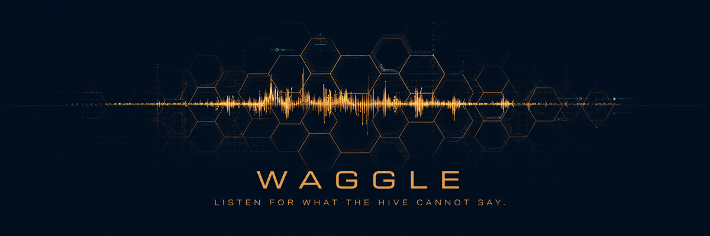
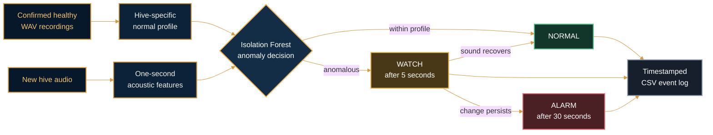

<div align="center">
  
</div>

<h1 align="center">One hive. Its own baseline. An early warning when the sound changes.</h1>

<p align="center">
  Waggle is a colony-specific acoustic monitor designed to detect persistent
  changes compatible with queen loss.
</p>

<p align="center">
  <a href="#current-evidence">Evidence</a> ·
  <a href="#processing-flow">How it works</a> ·
  <a href="#quick-start">Quick start</a> ·
  <a href="#reproduce-the-mendeley-replay">Reproduce</a>
</p>

<table>
  <tr>
    <th width="33%">LEARN</th>
    <th width="33%">LISTEN</th>
    <th width="33%">WARN</th>
  </tr>
  <tr>
    <td align="center">Builds a normal profile from confirmed healthy recordings</td>
    <td align="center">Compares each new second with that hive's own acoustic baseline</td>
    <td align="center">Escalates only when the acoustic change persists</td>
  </tr>
</table>

## Current evidence

<table>
  <tr>
    <th width="25%">Held-out accuracy</th>
    <th width="25%">Queen-loss sensitivity</th>
    <th width="25%">Healthy specificity</th>
    <th width="25%">Persistent alarm</th>
  </tr>
  <tr>
    <td align="center"><strong>94.17%</strong></td>
    <td align="center"><strong>100%</strong></td>
    <td align="center"><strong>88.33%</strong></td>
    <td align="center"><strong>30 seconds</strong></td>
  </tr>
</table>

The strongest result uses the public [Mendeley sudden queen-loss
dataset](https://data.mendeley.com/datasets/j97khfj656/1) (DOI
`10.17632/j97khfj656.1`): six complete days from one colony, with queen removal
on the morning of the final day.

| Evaluation stage | Data used | Outcome |
| --- | --- | --- |
| Healthy-profile training | Queenright days 1–4 | Baseline learned |
| Untouched validation | Queenright day 5 | No persistent alarm |
| Untouched test | Queenless day 6 | `WATCH` at 5 s, `ALARM` at 30 s |

> **What the alarm means**<br/>
> Persistent acoustic change compatible with queen loss was detected. Check
> the hive and queen.

An alarm is not proof that the queen has died. Disease, swarming, environmental
noise, microphone movement, and other colony stresses can also alter hive
acoustics. The 94.17% result demonstrates a colony-specific change detector on
one published feature dataset—not universal performance on arbitrary raw WAV
recordings or unseen hives. In a separate grouped AI-BELHA raw-WAV experiment,
generic queen-state classification reached 53.33% balanced accuracy.

## Processing flow



Raw WAV processing uses mono 16-bit PCM audio, resamples to 16 kHz when
necessary, and extracts 21 pyAudioAnalysis features with 50 ms windows, 25 ms
steps, and one-second aggregation.

## Quick start

Python 3.9 or newer is recommended.

### 1. Create the environment

```bash
python3 -m venv .venv
source .venv/bin/activate
python -m pip install -r requirements.txt
```

### 2. Reproduce the Mendeley replay

Download the Mendeley CSV and place it at:

```text
data/queen_loss_africanized_honeybee_dataset.csv
```

Run:

```bash
python ear/mendeley_streaming_monitor.py
```

Expected replay:

```text
queenright validation day: no alarm
queenless test day: WATCH at window 5, ALARM at window 30
```

The command writes:

```text
results/mendeley_isolation_monitor.joblib
results/mendeley_streaming_replay.json
```

### 3. Build a development WAV profile

First ingest a confirmed healthy WAV:

```bash
python ear/add_field_recording.py healthy.wav \
  --field-dir data/field \
  --timestamp 2026-09-14T12:00:00+03:00 \
  --site SITE01 --hive HIVE03 --device DEV01 \
  --microphone "microphone-model" --position "fixed-position" \
  --temperature 25 --humidity 60 --inspection queen_present
```

For a software demonstration with insufficient enrollment data:

```bash
python ear/build_wav_isolation_profile.py data/field/manifest.csv \
  --hive HIVE03 --output results/HIVE03_isolation.joblib \
  --development-override
```

`--development-override` profiles are for software testing only. Production
profile creation requires at least 42 confirmed healthy sessions across 14
days, one fixed hardware configuration, and complete temperature/humidity
metadata.

### 4. Monitor a WAV folder

```bash
mkdir -p inbox events
python ear/monitor_wav_folder.py \
  results/HIVE03_isolation.joblib inbox \
  --state events/HIVE03_state.json \
  --log events/HIVE03_events.csv \
  --watch --poll-seconds 5
```

Stop continuous monitoring with `Control-C`. Processed filenames and SHA-256
hashes are retained so unchanged files are not analyzed twice.

## Repository map

| Path | Purpose |
| --- | --- |
| `ear/mendeley_streaming_monitor.py` | Reproduce the sudden queen-loss replay |
| `ear/wav_isolation_monitor.py` | Score a single WAV recording |
| `ear/build_wav_isolation_profile.py` | Build a hive-specific healthy profile |
| `ear/monitor_wav_folder.py` | Continuously process incoming WAV files |
| `ear/add_field_recording.py` | Ingest a recording with field metadata |
| `ear/validate_field_manifest.py` | Check metadata and profile readiness |
| `data/` | Local datasets; excluded from Git |
| `results/` | Selected model artifact and evaluation metrics |
| [`docs/FIELD_PROTOCOL.md`](docs/FIELD_PROTOCOL.md) | Field recording and enrollment protocol |

## Research pipeline ready

The acoustic monitoring pipeline is complete and reproducible from profile
creation to persistent alarm generation.

| Capability | Result |
| --- | --- |
| Sudden queen-loss replay | Reproduces the held-out validation and test results |
| Raw-WAV processing | Resampling and one-second acoustic feature extraction operational |
| Hive enrollment | Builds a personal healthy baseline from labeled recordings |
| Persistent monitoring | Produces `NORMAL`, `WATCH`, and `ALARM` states |
| Continuous operation | Monitors incoming WAV files without duplicate processing |
| Event output | Writes timestamped, integration-ready CSV records |

This repository provides the tested acoustic detection layer that can feed an
application interface, local report generator, or notification service. Its
validated claim remains precise: Waggle detects persistent change relative to
a hive's learned healthy acoustic profile; an alarm requests inspection rather
than declaring queen death as a certainty.

---

<p align="center">
  <strong>Waggle</strong><br/>
  Listen for what the hive cannot say.<br/><br/>
  Built for the Microsoft AI Innovators Summer Program 2026.
</p>
